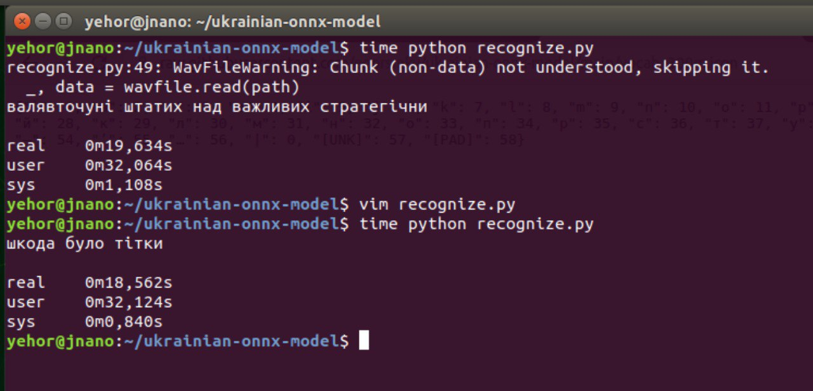
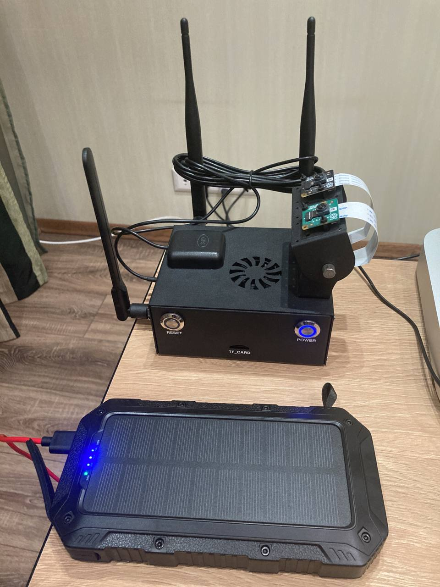

# An ONNX model for speech recognition of the Ukrainian language

## Overview

This repository contains an ONNX model for speech recognition of the Ukrainian language exported from [wav2vec2 1b model](https://huggingface.co/Yehor/wav2vec2-xls-r-1b-uk-with-lm).

If you want to export own ONNX model, follow this [Google Colab](https://colab.research.google.com/drive/1bvkwrdLl6rgbWdF2fYe0Tt0-CkG2vvBD?usp=sharing).

## Installation

Download [**onnx-uk-1b.zip**](https://www.dropbox.com/s/03qh8u10lkyfntz/onnx-uk-1b.zip?dl=0) (3.33 GB) file and unpack it in the repository folder.

There's the quantized version of the model (~300 MB), link: [onnx-uk-300m-quantized.onnx
](https://www.dropbox.com/s/lfskkg6c5hmltcd/onnx-uk-300m-quantized.onnx?dl=0). 

Note: replace **vocab.json** by **vocab_300m.json** file if you will use the quantized version.

Install Python dependencies:

```bash
pip install onnxruntime numpy scipy
```

## Running

```bash
python recognize.py
```

## Demo

The quantized version the ONNX model is running on a **Jetson Nano** computer:



Jetson Nano is charged by a Power Bank:




## Links

- Other Speech-to-Text implementations: https://github.com/egorsmkv/speech-recognition-uk
- Telegram community about speech recognition of the Ukrainian language: https://t.me/speech_recognition_uk

## Tensorflow

If you like to use Tensorflow, then there's a SavedModel - [tf_uk_300m_model.zip](https://www.dropbox.com/s/kf9pc671h8ffxk5/tf_uk_300m_model.zip?dl=0)

Use `tf_predict.py` to recognize files with the Tensorflow model.
